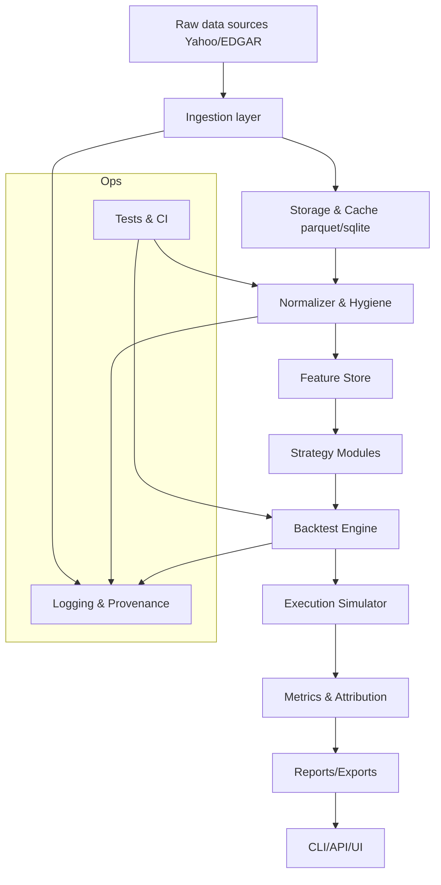

# Algorithmic Backtester — Design

## Design overview — high level

Goal: build a modular, auditable backtester whose components (ingest, feature store, engine, execution, reporting) can be reused by optimizer, risk, and reporting modules later.

Principles
- Isolation of data vs compute.
- Strict time-indexing to avoid look‑ahead.
- Vectorized core for speed with clear fallbacks to event-driven loops.
- Provenance: store raw snapshots + processing logs.
- Testability: unit + integration tests for math and edge cases.

## Core components

- Data Ingestion: fetch adjusted prices (yfinance) and optional raw filings (EDGAR) → store raw snapshots.
- Storage & Cache: parquet/SQLite timeseries cache with dataset versioning and TTL.
- Normalizer / Data Hygiene: align time indexes, fill/flag gaps, handle splits/dividends and corporate actions, currency normalization.
- Feature Store: derived series (returns, winsorized signals, moving averages) saved with provenance metadata.
- Strategy Interface: pluggable strategy functions that accept only historical data up to time t and emit target weights or orders.
- Backtest Engine: rebalancer loop (vectorized where possible), position sizing, transaction cost & slippage model, and P&L bookkeeping.
- Execution Simulator: fills (market/limit), lot rounding, partial fills, and simulated latency.
- Metrics & Attribution: cumulative returns, annualized stats, drawdowns, turnover, and basic attribution per factor.
- Reporting/Exports: CSV/JSON outputs, matplotlib/plotly charts, and HTML summaries for demos.
- CLI / API / UI: thin facades to run/inspect backtests and export results.
- Logging & Provenance: store raw inputs + transform steps + seed for reproducibility.
- Tests & CI: unit tests for math/edge-cases and a smoke integration test using cached data.

## Minimal interfaces (examples)

- fetch_prices(tickers, start, end) -> DataFrame[datetime, adj_close, volume, ...]
- compute_features(price_df, config) -> features_df
- strategy_step(history_df, params) -> target_weights or orders
- run_backtest(config) -> results {metrics, timeseries, trades, provenance}

## Design tradeoffs / decisions

- Use adjusted close for returns but keep raw price + corporate-action log for auditing.
- Vectorized rebalancing (pandas/numpy) for speed; allow event-driven loop for realistic execution later.
- Keep simple transaction-cost model initially (fixed bps + slippage multiplier).
- Enforce timezone-aware, business-day-aligned indexing to avoid subtle bugs.
- Persist raw snapshots every run to enable exact replay and debugging.

## Mermaid diagram (component + data flow)

## Short next step suggestion

Validate ingestion + storage + a tiny vectorized backtest loop on 10 tickers for one year to prove assumptions (data hygiene, adjusted prices, simple momentum strategy); then expand features and tests.
