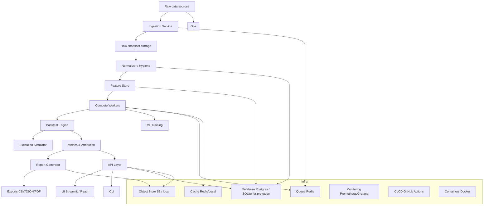
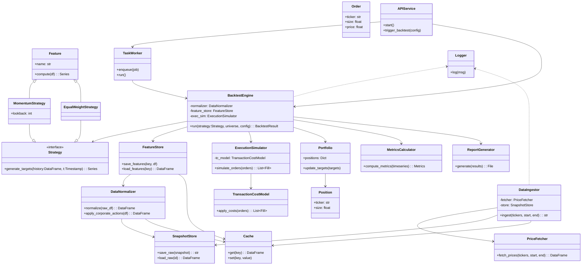

# Algorithmic Backtester — Tech Design

This document describes a recommended tech stack and architecture for the algorithmic backtester MVP, including an architecture diagram and short component descriptions with rationale.

## Architecture diagram



## Component descriptions and recommended tech

- Raw data sources
  - Yahoo Finance prototype, SEC EDGAR for filings; later add licensed vendors as needed.
  - Why: free and accessible for prototyping; EDGAR provides authoritative filings when required.

- Ingestion Service
  - Tech: Python scripts or a small FastAPI ingestion endpoint; use `yfinance` and `requests` for feeds.
  - Why: simple to implement and easy to schedule cron, GitHub Actions for prototypes.

- Raw snapshot storage
  - Tech: local object storage project folder or S3 for production.
  - Why: immutable snapshots are essential for provenance and reproducibility.

- Normalizer / Hygiene
  - Tech: pandas-based pipeline that outputs parquet files.
  - Why: pandas is fast for ETL at prototype scale and parquet is efficient for time-series storage.

- Feature Store
  - Tech: parquet partitions or Postgres timeseries tables depending on scale.
  - Why: parquet is low-cost and fast for local dev; Postgres offers richer querying for production.

- Compute Workers
  - Tech: simple task queue RQ or Celery backed by Redis, or threaded workers for local runs.
  - Why: decouples heavy compute backtests, ML from the API and UI layers.

- Backtest Engine
  - Tech: Python pandas/numpy, structured as deterministic, vectorized computations.
  - Why: fast iteration, reproducible results, easy to test.
  - Libraries: prefer `vectorbt` for fast, vectorized strategy prototyping and `backtrader` for event-driven, execution-realistic tests.
  - Integration note: use `vectorbt` to rapidly iterate signals and validate large-universe behavior; wrap or port promising strategies into `backtrader` (or a custom execution simulator) for realistic fills, latency, and order handling before productionizing.

- Execution Simulator
  - Tech: pluggable Python models for slippage, fills, and lot constraints.
  - Why: keeps the core engine clean while allowing realistic execution modeling.

- ML Training
  - Tech: scikit-learn for simpler models; PyTorch for deep learning experiments.
  - Why: flexible choice depending on model complexity.
  - Backtesting libraries: vectorbt — high-performance, numpy/vectorized backtesting for quick experiments; backtrader — mature event-driven engine for execution realism and broker-like simulations.

- API Layer
  - Tech: FastAPI for light, async endpoints exposing runs, results, and logs.
  - Why: Fast, well-documented and easy to test.

- UI
  - Tech: Streamlit for internal prototypes; React/Vite for production dashboards.
  - Why: Streamlit is quick to ship demos; React scales for UX polish and multi-page apps.

- CLI
  - Tech: Click or argparse-based Python CLI that triggers local runs or calls the API.
  - Why: useful for quick scripted workflows and automation.

- Persistence
  - Tech: Postgres for metadata; parquet or object store for timeseries and snapshots; SQLite acceptable for local prototypes.
  - Why: separation of metadata and timeseries simplifies backups and query patterns.

- Queue & Cache
  - Tech: Redis for both job queue and cache.
  - Why: lightweight and widely supported.

- Observability & CI
  - Tech: GitHub Actions, Prometheus + Grafana for metrics, structured logging JSON for traceability.
  - Why: automated tests and monitoring for production stability.

- Deployment
  - Tech: Docker for reproducible environments, optionally Kubernetes for scaling workers.
  - Why: portable and production-ready.

## Why this stack

- Fast prototyping using `yfinance`, pandas and Streamlit; straightforward to harden later with FastAPI, Postgres, Redis, and S3.
- Clear separation between immutable snapshots object store, derived features parquet/Postgres, and compute workers improves reproducibility and parallelism.
- The stack is inexpensive to run for an MVP and straightforward to scale.

## Next steps

1. Create a minimal scaffold: repo layout, `requirements.txt`, and a small `scripts/` sample that fetches price data and writes a raw snapshot.
2. Implement the storage/cache and a vectorized backtest loop for a 10-ticker test to validate assumptions.

---

Updated: 2025-10-17

## UML class diagram

Below is a UML-style class diagram (Mermaid) showing core classes and relationships for the backtester.



## Class descriptions

- PriceFetcher — fetches raw price/time-series from data sources (e.g., `yfinance`).
- SnapshotStore — persists immutable raw snapshots for provenance and replay.
- Cache — local cache (parquet or Redis) for recently requested series.
- DataIngestor — coordinates fetching and saving raw snapshots (uses PriceFetcher and SnapshotStore).
- DataNormalizer — adjusts and aligns raw series, applies corporate action logic and timezone normalization.
- FeatureStore — stores derived series (returns, signals) and their provenance metadata.
- Feature — encapsulates a single derived timeseries computation (e.g., momentum, SMA).
- Strategy (interface) — given historical inputs, outputs target weights or orders at time t.
- MomentumStrategy / EqualWeightStrategy — concrete strategy implementations that implement the Strategy interface.
- BacktestEngine — core orchestration: loads data, calls strategy, simulates execution, records trades and P&L.
- Portfolio — current holdings container and utility to compute target trades from weights.
- Position — single security holding representation.
- Order — order object emitted by strategy/portfolio to be executed by the ExecutionSimulator.
- ExecutionSimulator — applies slippage, rounding, partial fills and returns fills/trades.
- TransactionCostModel — pluggable model for explicit costs and slippage.
- MetricsCalculator — computes performance statistics and attribution from timeseries and trades.
- ReportGenerator — renders CSV/JSON/HTML/PDF outputs from backtest results.
- TaskWorker — background job runner (enqueues and executes long-running backtests or ML jobs).
- APIService — FastAPI layer to trigger runs, fetch results and stream logs.
- Logger — centralized structured logging and provenance recorder.

This UML sketch is intentionally lightweight — it focuses on responsibilities and boundaries so you can implement concrete classes in Python with clear unit-test targets.

---

Updated: 2025-10-17

## Recommended Python packages

Below are suggested Python packages grouped by purpose with a short rationale for each. Use the minimal requirements snippet at the end to bootstrap a virtual environment.

Core data and numerical
- pandas — primary tabular/time‑series operations and I/O.
- numpy — vectorized numeric operations and arrays.
- pyarrow / fastparquet — efficient parquet read/write for snapshots & features.

Data ingestion & sources
- yfinance — quick Yahoo Finance prototyping (price/fundamentals).
- requests — HTTP client for EDGAR and other REST feeds.

ETL / data hygiene / features
- pandas_ta or ta — common technical indicators and signal helpers.
- numba — optional JIT to accelerate tight numeric loops.

Backtest engine & math
- scipy — statistics and numerical utilities.
- statsmodels — regressions and attribution calculations.

Execution, queue, & caching
- redis — cache and lightweight queue broker for workers.
- rq or celery — background job workers (RQ is simpler for MVP).

Persistence & infra
- sqlalchemy — DB ORM for metadata and results.
- psycopg2-binary — Postgres driver for production metadata.
- boto3 — S3 integration for snapshots (optional for local dev).

API, CLI, UI
- fastapi — lightweight, type-safe API layer.
- uvicorn — ASGI server for FastAPI.
- streamlit — fast internal dashboards and demos.
- click — CLI tooling for scripts and automation.

ML & modeling
- scikit-learn — baseline ML models and pipelines.
- xgboost / lightgbm — gradient-boosted trees for stronger baselines.
- joblib — model persistence and parallelism.

Visualization & reporting
- matplotlib / seaborn — static plots for reports.
- plotly — interactive charts for UI and exports.
- weasyprint or wkhtmltopdf (pdfkit) — HTML → PDF generation.

Validation, testing & QA
- pytest — unit/integration tests.
- hypothesis — property-based tests for numeric correctness (optional).
- black / flake8 / mypy — formatting, linting, and static typing.

Utilities & observability
- pydantic — config and data validation.
- python-dotenv — local env var management.
- structlog or loguru — structured logging.
- prometheus_client — basic metrics for monitoring.

Containerization & CI
- docker / docker-compose — reproducible local & cloud runs.
- GitHub Actions — CI to run tests and builds.

Minimal requirements (requirements.txt starter)
````text
pandas
numpy
pyarrow
fastparquet
yfinance
requests
pandas_ta
numba
scipy
statsmodels
redis
rq
sqlalchemy
psycopg2-binary
boto3
fastapi
uvicorn
streamlit
scikit-learn
xgboost
matplotlib
plotly
pytest
black
pydantic
python-dotenv
vectorbt
backtrader
````
